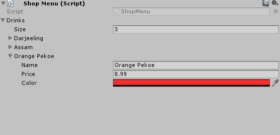
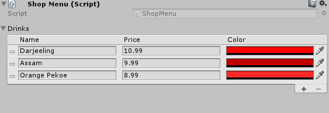

# ReorderableListUtility

## What is this
A wrapper function that easily build ReorderableList for array serailized property. 

ReorderableList is a undocumented editor class that visualize list in UnityEditor. 

See [this post](http://va.lent.in/unity-make-your-lists-functional-with-reorderablelist/) for more information.

This is build-in array editor



Visualized by Reorderable-list



## Getting Started

- Copy [/Assets/Editor/ReorderableListUtility.cs](/Assets/Editor/ReorderableListUtility.cs) into your project
- Create custom editor for your class
- Use example code to build ReorderableList and use it to layout editor

Example editor [Assets/Example/Editor/ShopMenuEditor.cs](Assets/Example/Editor/ShopMenuEditor.cs)

## Example

Create ReorderableList

```csharp
var property = this.serializedObject.FindProperty("MyArrayProperty");
var list = ReorderableListUtility.CreateAutoLayout(property);
```

Do Layout

```csharp
// With foldout
ReorderableListUtility.DoLayoutListWithFoldout(list);

// Or original
list.DoLayoutList()
```

Create ReorderableList with custom headers

```csharp
var list = ReorderableListUtility.CreateAutoLayout(
   property, 
  new string[] { "Column1", "Column2", "Column3" },
);
```

Or create ReorderableList with custom column widths

```csharp
var list = ReorderableListUtility.CreateAutoLayout(
   property, 
   null,
   new float?[] { 100, 100, 100 },
);
```

Or combine them

```csharp
var list = ReorderableListUtility.CreateAutoLayout(
   property, 
   new string[] { "Column1", "Column2", "Column3" },
   new float?[] { 100, 100, 100 },
);
```

Or specify last column width and auto adject others
```csharp
var list = ReorderableListUtility.CreateAutoLayout(
   property, 
   new string[] { "Column1", "Column2", "ColumnLast" },
   new float?[] { null, null, 100 },
);
```

## License

This project is licensed under the Apache License - see the [LICENSE.md](LICENSE.md) file for details
